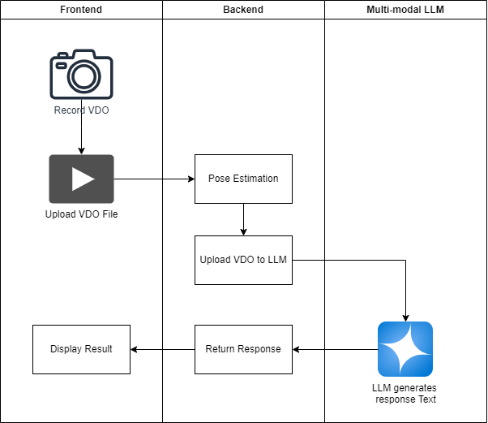
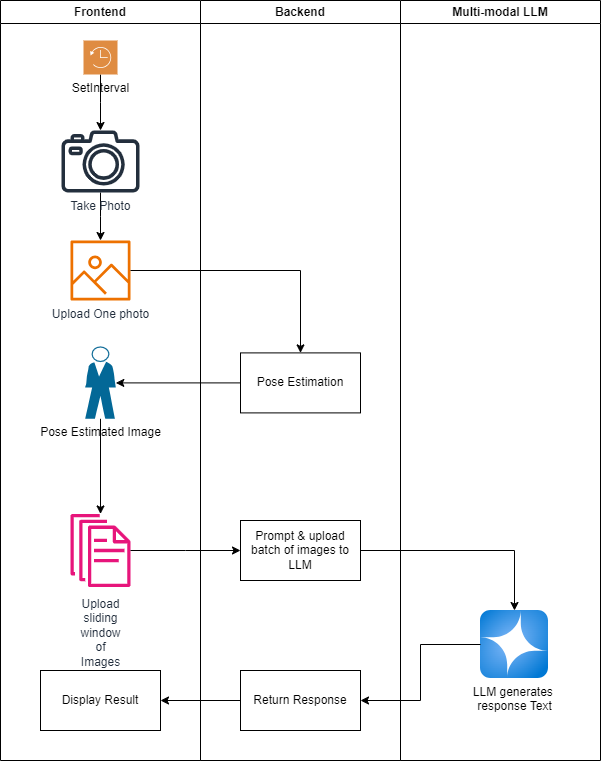
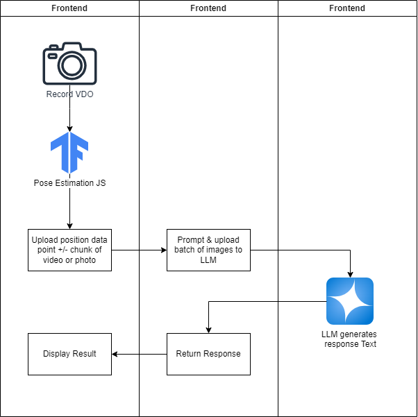

# FitCheck: System Design

## User Stories

1. ต้องการทราบว่า การออกกำลังกาย Weight Training ท่าที่ทำอยู่นั้นถูกต้องหรือไม่
2. เลือกรูปแบบการออกกำลังกาย ตั้งกล้อง และถ่ายวิดีโอ แล้วระบบจะทำการวิเคราะห์ว่าท่าที่ทำอยู่นั้นถูกต้องหรือไม่ ควรปรับแก้อย่างไร

## Requirement Analysis

### Breakdown of User Stories

สามารถสรุปความต้องการผู้ใช้งานออกมาได้ดังนี้

1. สามารถเลือกรูปแบบการออกกำลังกายได้
2. กดถ่ายวิดีโอได้
3. ระบบจะทำการวิเคราะห์ว่าท่าที่ทำอยู่นั้นถูกต้องหรือไม่ ควรปรับแก้อย่างไร แบบ Real-time

> ในกรณี Idea case: ระบบควรวิเคราะห์ VDO ออกมาได้ทันที  
> ซึ่งต้องวาง model ไว้บน Edge computing หรือ Stream VDO ไปยัง cloud และประมวลผลแบบ real-time
> ซึ่งใช้เวลาพัฒนานาน และมีค่าใช้จ่ายสูง

### Minimum Viable Product (MVP)

เพื่อพัฒนา Minimal Viable Product (MVP) ให้เร็ว และมีค่าใช้จ่ายต่ำ จึงเลือกพัฒนาเป็น

- Web Application ที่รองรับการถ่ายภาพและวิเคราะห์ภาพ
- วาง model เป็นแบบ Stateless บน cloud
- ใช้ Multi-modal generative AI ในการวิเคราะห์ภาพหรือวิดีโอ และสร้างคำแนะนำ

ซึ่งสามารถทำออกมาได้ 3 รูปแบบ

#### 1. อัด VDO ให้เสร็จ แล้วส่งให้ระบบทำการวิเคราะห์บน cloud

1. บันทึก VDO ด้วย Library ของ Frontend
2. Upload file ไปยัง Backend

**ตัวอย่าง**

- <https://medium.com/@dreamai/a-i-exercise-posture-assistant-using-gpt-4-vision-with-a-fastapi-backend-and-a-streamlit-frontend-c81b38a03069

**ข้อดี**

- สามารถทำได้เร็ว (มีคนพัฒนามาก่อน)
- อัพโหลด VDO ให้ Generative AI เลย (คาดว่า) AI จะวิเคราะห์ได้แม่นยำขึ้น
- กระบวนการทำงานเรียบง่าย

**ข้อเสีย**

- ไม่สามารถทำแบบ Real-time มี latency ในการอัพโหลด VDO และรอผลลัพธ์ 10 - 30 วินาที

#### 2. ถ่ายภาพโดยอัตโนมัติ ด้วยอัตราที่ไวมากพอ แล้วส่งให้ระบบทำการวิเคราะห์บน cloud

1. เมื่อผู้ใช้งานกดบันทึก ระบบจะถ่ายภาพ (setInterval) ทุก 200 ms - ตัวเลขนี้เป็นตัวอย่างเท่านั้น
2. ส่งภาพไปยัง Backend เพื่อปักหมุด Pose Estimation แล้วเก็บผลลัพธ์ไว้บน Frontend
3. หลังจากได้ภาพครบตามขนาด Sliding windows: Front end ส่งภาพใน Sliding window 2 วินาทีล่าสุด (หรือเวลาที่กำหนด) ไปยัง Backend อีก path เพื่อวิเคราะห์ความถูกต้องของท่าที่ทำอยู่
4. Backend นำภาพที่ปักหมุด Pose Estimation แล้ว ส่งไปยัง Generative AI ในการวิเคราะห์ความถูกต้องของท่าที่ทำอยู่
5. ระบบจะส่งผลลัพธ์กลับมาแสดงบนหน้าเว็บ

**ข้อดี**

- ลด latency ในการรอผลลัพธ์ ทำให้ดูเหมือน real-time มากขึ้น

**ข้อเสีย**

- ซับซ้อนกว่าวิธีที่ 1
- กลัวว่าส่งภาพไปเป็น Shot จะทำให้ Gen AI สับสนกับภาพที่ไม่เป็นต่อเนื่อง

#### 3. ถ่าย VDO และประมวลผล Pose Estimation บน Frontend แล้วส่งไปวิเคราะห์บน Backend

1. ถ่าย VDO ด้วย Library ของ Frontend
2. ประมวลผล Pose Estimation บน Frontend
3. ส่ง Pose Estimation ไปยัง Generative AI ในการวิเคราะห์ความถูกต้องของท่าที่ทำอยู่
4. ระบบจะส่งผลลัพธ์กลับมาแสดงบนหน้าเว็บ

**ตัวอย่าง**

1. <https://blog.lytix.co/posts/ai-form-checker>

**ข้อดี**

- ลด latency ในการรอผลลัพธ์ ทำให้ดูเหมือน real-time มากขึ้นอีก
- ไม่ต้องส่งไฟล์ขนาดใหญ่ไปยัง Backend

**ข้อเสีย**

- เดาว่า Prompt ยากขึ้น (มีแต่ตัวเลขล้วน ๆ) เว้นแต่ว่าจะหาต้วอย่าง Prompt จาก paper ได้
- ภาระการประมวลผลมากขึ้นกับ Client
